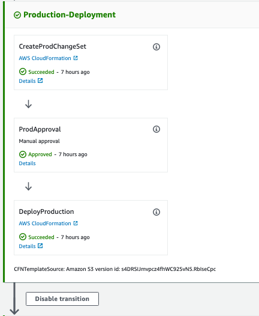

# Multi Region Code Pipeline

## Problem Statement

"How do you deploy a multi region Aurora Cluster in an automated pipeline?"

## TL;DR

Use AWS CodePipeline to deploy CloudFormation templates to both the Primary and Secondary Region.

## My Solution

Firstly, why would you want a multi region Aurora Cluster, and secondly why would you want an automated pipeline to deploy it?

Having a replica Aurora Cluster in a secondary region could be used for two main purposes:
1. Disaster Recovery. The Replica Cluster is your hot standby.
2. Increase performance for read operations in the remote region.

Deploying it using an automated pipeline brings all the benefits of Infrastructure as Code.  
Importantly:
1. Speed and simplicity - the replica is created automatically
2. Consistency - if it's correct once, it's correct every time.  There's no possibility of someone misconfiguring the replication

Reading through the [AWS documentation on cross region Aurora Cluster replication](https://docs.aws.amazon.com/AmazonRDS/latest/AuroraUserGuide/AuroraMySQL.Replication.CrossRegion.html) you get the following options:


I knew that AWS CodePipeline supported Cross Region deployments with CloudFormation, but exactly how to use this with Aurora was something I'd done before.

## Intended Solution

My proposed solution was to consist of the following:

* Deployment into one Primary (ap-southeast-2) and at one Secondary region (us-east-1)
* Demonstrate cross-region S3 bucket replication
* Use Nested Stacks
* Aurora MySQL Regional Cluster in Primary Region with Cluster Replica in Secondary Region
* All deployments through CodePipeline

## Prerequisites

In a typical single region AWS CodePipeline, you need to specify one 'ArtifactStore':

```yaml
DeployPipeline:
  Type: "AWS::CodePipeline::Pipeline"
  Properties:
    ArtifactStore:
      Type: S3
      Location:
        Ref: ArtifactBucket
```

In order to use AWS CodePipeline across multiple AWS Regions, you need to provide an 'ArtifactStores' map with an 'ArtifactStore' for each region:


```yaml
DeployPipeline:
  Type: "AWS::CodePipeline::Pipeline"
  Properties:
    ArtifactStores:
      - Region: !Ref PrimaryRegion
        ArtifactStore:
          Type: S3
          Location:
            Ref: PrimaryRegionS3ArtifactBucket
      - Region: !Ref SecondaryRegion
        ArtifactStore:
          Type: S3
          Location:
            Ref: SecondaryRegionS3ArtifactBucket
```

Wanting to keep with the 'automate everything' plan, I deployed an AWS CodePipeline in each region that would then deploy the necessary prerequisites using nested CloudFormation stacks.

This [pre-req-pipeline.yml](pipelines/pre-req-pipeline.yml) was deployed in both Primary and Secondary regions.

Note: these pipelines use S3 as a Source/trigger, but it could just as easily be AWS CodeCommit.

The [deployPreReqPipelines.sh](deployPreReqPipelines.sh) script will automate the deployment of these two pipelines.

```bash
#Deploy Prerequisites Pipeline in Primary Region
aws cloudformation deploy \
  --region $PRIMARY_REGION \
  --template-file pipelines/pre-req-pipeline.yml \
  --stack-name MULTI-REGION-PIPELINE-PREREQ \
  --capabilities CAPABILITY_NAMED_IAM \
  --parameter-overrides SourceS3Key=prereq-templates.zip PRODApprovalEmail=$PROD_APPROVAL_EMAIL \
  --tags Environment=PROD Purpose="Multi Region CodePipeline Prerequisites"

#Deploy Prerequisites Pipeline in Secondary Region
aws cloudformation deploy \
  --region $SECONDARY_REGION \
  --template-file pipelines/pre-req-pipeline.yml \
  --stack-name MULTI-REGION-PIPELINE-PREREQ \
  --capabilities CAPABILITY_NAMED_IAM \
  --parameter-overrides SourceS3Key=prereq-templates.zip PRODApprovalEmail=$PROD_APPROVAL_EMAIL \
  --tags Environment=PROD Purpose="Multi Region CodePipeline Prerequisites"

```

Once these pipelines were created, it was then time to setup the CloudFormation stacks to create the Artifact S3 Buckets.

This main [master-stack.yml](templates/prereq/master-stack.yml) only has one child stack that creates the S3 Bucket.
While it would have been easier to just deploy a single template instead of these pipelines, my thought was that I'd probably end up adding to this if I was to do cross region and cross account deployments.

The [copyPrereqTemplatesToS3.sh](copyPrereqTemplatesToS3.sh) script zip'd the templates and uploads to S3.

Note: this script uses 'jq' to parse the JSON returned from the cli.

With these two S3 Buckets now created, it was time to setup the main pipeline.

## Multi Region CodePipeline

Here's an overview of what the pipeline will need:

1. Source: S3
2. Build: Extract
3. Build: Verify and upload child stacks to S3
4. (not included) Non-Prod Deploy: deploy to single region
5. Prod Deployment:
  * Deploy any Prerequisites in Secondary Region
  * Deploy Master stack in Primary Region
  * Deploy Master stack in Secondary Region

This pipeline template is: [here](pipelines/multi-region-pipeline.yml)

The [deployMultiRegionPipeline.sh](deployMultiRegionPipeline.sh) script I used to deploy it looked up the two S3 Buckets and then deployed this to the required regions:

```yaml
#!/bin/sh

PRIMARY_REGION=ap-southeast-2
SECONDARY_REGION=us-east-1

PROD_APPROVAL_EMAIL=your@email.here

printf "\nDeploying Multi Region Pipeline in $PRIMARY_REGION\n"

#Lookup Prerequisites S3 Bucket in Primary Region
PrimaryPrereqS3Bucket=$(aws cloudformation describe-stacks --region ${PRIMARY_REGION} --stack-name MULTI-REGION-PIPELINE-PREREQ | jq -r '.Stacks[0].Outputs[0].OutputValue' )

#Lookup Prerequisites S3 Bucket in Secondary Region
SecondaryPrereqS3Bucket=$(aws cloudformation describe-stacks --region ${SECONDARY_REGION} --stack-name MULTI-REGION-PIPELINE-PREREQ | jq -r '.Stacks[0].Outputs[0].OutputValue' )

#Deploy main multi region pipeline in Primary Region
aws cloudformation deploy \
  --region $PRIMARY_REGION \
  --template-file pipelines/multi-region-pipeline.yml \
  --stack-name MULTI-REGION-PIPELINE \
  --capabilities CAPABILITY_NAMED_IAM \
  --parameter-overrides \
      PrimaryRegion=$PRIMARY_REGION \
      SecondaryRegion=$SECONDARY_REGION \
      PrimaryRegionS3ArtifactBucket=$PrimaryPrereqS3Bucket \
      SecondaryRegionS3ArtifactBucket=$SecondaryPrereqS3Bucket \
      SourceS3Key=multi-region-templates.zip \
      PRODApprovalEmail=$PROD_APPROVAL_EMAIL \
  --tags Environment=PROD Purpose="Multi Region CodePipeline"
```

## Multi Region Stacks

I wanted the following as part of my solution:

1. VPC in each Region (I used one of my standard 3-tier 3 AZ [VPC templates](templates/multiregion/vpc-stack.yml))
2. [S3 bucket in Primary Region](templates/multiregion/s3-stack.yml) with cross region replication to another [S3 bucket](templates/multiregion/s3-replicant-stack.yml) in the Secondary Region
3. [KMS key](templates/multiregion/kms-stack.yml) in each Region
4. Aurora MySQL Cluster with 1 writer in the Primary Region
5. Aurora MySQL Replica Cluster with 1 writing in the Secondary Region

A few notes on Aurora cross region replication:
1. If the Source has StorageEncrypted=true, then you MUST specify the KMS Key Id in the Target
2. Specify a different DBClusterIdentifier for the Replica Cluster. By default it creates a database of this name with prevents replication from the Source starting.
3. Replication needs at least one writer instance in each Cluster (there must be a writer instance in the Primary Cluster prior to creating the Replica Cluster).

### Master Stacks

With S3 cross region replication, I needed the target bucket to be created in the Secondary Region before I created the source bucket in the Primary Region.

This was done with the [master-stack-predeploy-us-east-1.yml][templates/multiregion/master-stack-predeploy-us-east-1.yml] stack.  This creates the S3 Bucket and has the Bucket Name as an Output of the master stack.

```yaml
Outputs:
  ReplicantS3Bucket:
    Description: "S3 Bucket Name to use as Target for Cross Region Replication"
    Value:
      Fn::GetAtt: ReplicantS3Stack.Outputs.S3BucketId
```

The CodePipeline will then take the output of this stack, and pass it as an InputArtifact to the main stack in the Primary Region.

Register the Output in the Pre Deploy ('OutputFileName' and 'OutputArtifacts'):

```yaml
- Name: DeployProduction
  Region: !Ref SecondaryRegion
  InputArtifacts:
    - Name: ProdPredeploymentChangeSetSecondaryRegion
  ActionTypeId:
    Category: Deploy
    Owner: AWS
    Version: 1
    Provider: CloudFormation
  Configuration:
    ActionMode: CHANGE_SET_EXECUTE
    ChangeSetName: ProdCBChangeSet
    OutputFileName: SecondaryPreqOutput.json
    StackName:
      Fn::Sub: PROD-PREDEPLOY-${AWS::StackName}
  OutputArtifacts:
    - Name: SecondaryPrereqOutput
  RunOrder: 3
```

Consume ('InputArtifacts' and 'ParameterOverrides') in the main stack:

```yaml
- Name: CreateProdChangeSet
  Region: !Ref PrimaryRegion
  InputArtifacts:
    - Name: CFNTemplateArtifact
    - Name: SecondaryPrereqOutput
  ActionTypeId:
    Category: Deploy
    Owner: AWS
    Version: 1
    Provider: CloudFormation
  OutputArtifacts:
    - Name: ProdChangeSet
  Configuration:
    ActionMode: CHANGE_SET_REPLACE
    ChangeSetName: ProdCFChangeSet
    RoleArn:
      Fn::GetAtt: [ CloudFormationRole, Arn ]
    Capabilities: CAPABILITY_NAMED_IAM
    StackName:
      Fn::Sub: PROD-${AWS::StackName}
    TemplateConfiguration: CFNTemplateArtifact::config-prod.json
    ParameterOverrides: |
      {
        "ReplicantBucket": { "Fn::GetParam" : ["SecondaryPrereqOutput", "SecondaryPreqOutput.json", "ReplicantS3Bucket"]}
      }
    TemplatePath: CFNTemplateArtifact::master-stack.yml
  RunOrder: 1
```


The main stack in the Primary Region is: [master-stack.yml](templates/multiregion/master-stack.yml)

It uses the 'ReplicantBucket' to register the cross region replication.

The Output has the Aurora Cluster Identifier to use as the Replication Source in the Secondary Region.

```yaml
Outputs:

  AuroraClusterIdentifier:
    Description: Aurora Cluster Identifier
    Value:
      Fn::GetAtt: AuroraMySQLClusterStack.Outputs.ClusterIdentifier
```

Which is passed on by the CodePipeline:

```yaml
ParameterOverrides: |
  {
    "ReplicationSourceIdentifier": { "Fn::GetParam" : ["ProdStackOutput", "ProdStackOutput.json", "AuroraClusterIdentifier"]}
  }
```

### Aurora Cluster Template

The same CloudFormation template was used for both the Primary and Secondary regions.

The use of Conditions and If allows the correct values to be set.

Note:
1. ReplicationSourceIdentifier must be the full ARN of the Aurora Cluster.
2. SourceRegion must only be supplied if ReplicationSourceIdentifier is provided
3. If ReplicationSourceIdentifier is provided, then do NOT set the following:
  * DatabaseName
  * MasterUserPassword
  * MasterUsername

There is no need to open up security groups between the two VPCs/Clusters - AWS magic takes care of this for you.

## Verdict

I think that using AWS CodePipeline to automate deployments across multiple regions is quite straight forward.

It meets the primary objective of deploying everything as code. No console access was required, and other from deploying the 3 pipelines and uploading templates the CLI wasn't used.

## Warnings

These scripts are NOT production ready!
1. The CloudFormation Role in the CodePipelines has AdministratorAccess - change this!
2. The Aurora Cluster templates have hardcoded passwords. Use Secrets Manager / Parameter Store instead!

## Clean up

Some considerations when cleaning up (aka deleting the CloudFormation parent stacks) these resources:
1. You can't delete an Aurora Replica while it's still replicating. You will need to promote it first, then delete it.
2. With the mutli region CodePipeline, delete the entire Secondary Region before deleting the Primary Region stacks.

## The Pipelines

### Prerequisites Pipeline


### Multi Region Pipeline





